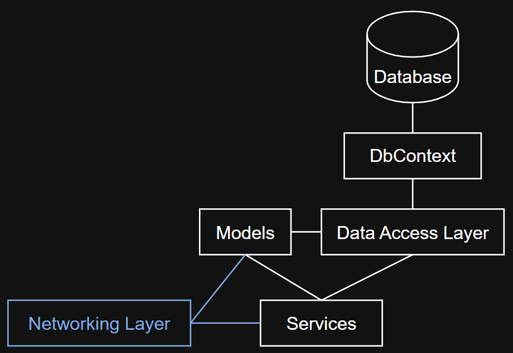
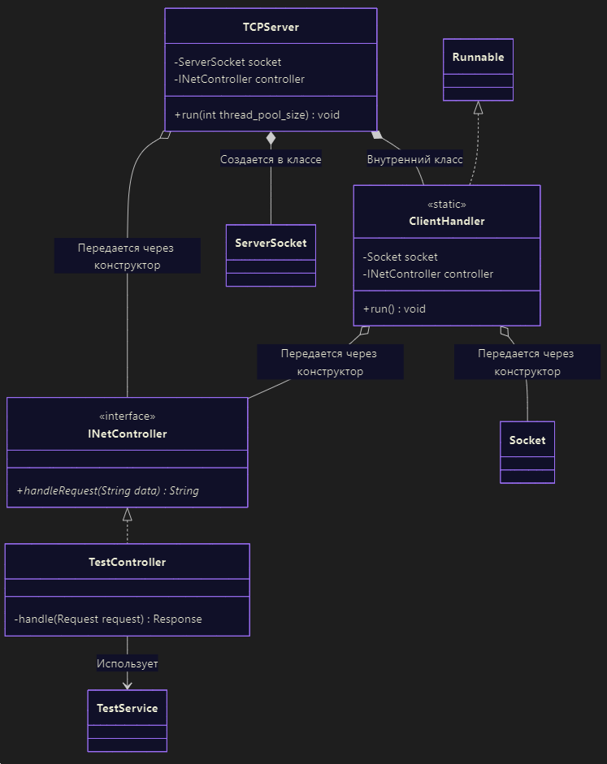

**Современные технологии серверной разработки**

## Лабораторная работа №2 (6 ч)

**Тема:** Разработка сетевого приложения на Java с использованием протоколов TCP и UDP.

**Цель работы:** освоить принципы разработки сетевых приложений на языке Java с использованием протоколов TCP и UDP.

### Теоретические сведения

#### Протоколы TCP и UDP
Протоколы TCP (Transmission Control Protocol) и UDP (User Datagram Protocol) - это транспортные протоколы для передачи данных между компьютерами и другими устройствами. Они работают на транспортном уровне модели OSI, обеспечивая доставку данных от одного приложения к другому.

Протокол TCP обеспечивает надежную передачу данных: он устанавливает соединение, контролирует доставку пакетов, обеспечивает порядок следования и повторную отправку потерянных данных.

Протокол UDP предоставляет более простой и быстрый способ передачи данных без установления соединения, контроля доставки или порядка. В основном он используется для приложений, где важна скорость, а не надежность, например, для потокового видео или онлайн-игр.

TCP и UDP являются базовыми протоколами для написания сетевых программ. В большинстве языков программирования существуют встроенные средства и библиотеки для работы с этими протоколами.

Поскольку множество программ на одном устройстве могут использовать сеть одновременно, необходимо различать для какого именно приложения предназначены полученные данные. Для идентификации конкретного приложения или службы на устройстве используется сетевой порт. IP-адрес указывает на устройство в сети, а порт - на конкретный процесс или службу на этом устройстве. Например, веб-сервер обычно использует порт 80 (HTTP) или 443 (HTTPS).

Единицей передачи данных в этих протоколах является байт. Протокол TCP воспринимает данные как непрерывный поток, который разбивается на сегменты. UDP оперирует датаграммами, каждая из которых представляет собой независимый блок данных, размером в несколько сотен или тысяч байт, который передается целиком. Независимо от способа упаковки, базовой единицей обработки информации всё равно остается байт.

#### Сокеты
Сокет - это программный интерфейс, который позволяет программам обмениваться данными по сети. Он выступает как «конечная точка» сетевого соединения, например, с одной стороны сервер, с другой - клиент.

В  Java сокеты - это объекты из пакета `java.net`, которые инкапсулируют всю низкоуровневую работу с сетью и предоставляют удобные методы для отправки и получения данных по сети.

Для создания сетевого приложения в Java используются разные типы сокетов в зависимости от протокола:
- для TCP:
	- `ServerSocket` - для прослушивания входящих подключений на сервере
	- `Socket` - клиентский сокет для установления соединения и обмена данными
	- данные передаются через потоки ввода/вывода (`InputStream` / `OutputStream`)
- для UDP:
	- `DatagramSocket` - для отправки и приёма пакетов
	- `DatagramPacket` - контейнер для данных и адреса назначения/источника
	- данные передаются в виде отдельных пакетов

#### Пул потоков
Когда сервер обслуживает множество клиентов, он обычно создаёт отдельный поток для каждого подключения. Однако создание и уничтожение потоков - операция затратная по времени и памяти.

Пул потоков (thread pool) - это механизм, при котором заранее создаётся ограниченное количество потоков, и они многократно используются для выполнения задач. Вместо того чтобы каждый раз создавать новый поток, сервер помещает задачу в очередь, а свободный поток из пула берёт её на выполнение.

В Java пул потоков реализован через интерфейс `ExecutorService` и фабричные методы класса `Executors` для создания пула потоков:
- `newFixedThreadPool(n)` - фиксированное число потоков
- `newCachedThreadPool()` - динамический пул, создаёт новые потоки при необходимости
- `newSingleThreadExecutor()` - один поток для последовательной обработки

Размер пула потоков подбирается экспериментально, исходя из числа ядер процессора и характера задач.

#### Организация структуры сетевого приложения
Механизм сетевого взаимодействия необходимо внедрять таким образом, чтобы в процессе внедрения Вам не пришлось менять бизнес-логику приложения. Сокеты - это один из способов взаимодействия с Вашим приложением (как, например, и UI), поэтому работу с ними необходимо выделить в отдельный слой. Например:

<p align="center">
  
</p>

Здесь `Networking Layer` - это слой сетевого взаимодействия.

Слой сетевого взаимодействия нужно разделить на следующие классы:
- класс, который отвечает за создание серверного сокета, его настройку и прослушивание клиентских подключений
- класс, который отвечает за работу с клиентским подключением
- класс, который отвечает за обработку данных от клиента и за формирование ответа

Также необходимо создать классы для данных, которые приходят от клиента, и которые сервер отправляет клиенту в качестве ответа (например, `Request`, `Response`), они же - модели данных.

Класс запроса от клиента:

```Java
public class Request {
    private final String method;
    private final String data;

    public Request(String command, String value) {
        this.method = command;
        this.data = value;
    }

    /**
     * Парсинг запроса от клиента в виде строки и формирование объекта Request
     * @param string Строка запроса от клиента в виде строки
     * @return Объект Request
     * @throws WrongRequestStringException Выбрасывается, если строка
     * задана не в верном формате
     */
    public static Request fromString(String string) throws WrongRequestStringException {
        String[] parts = string.split(";");

        if (parts.length != 2) {
            throw new WrongRequestStringException();
        }

        return new Request(parts[0], parts[1]);
    }

    @Override
    public String toString() {
        return this.method + ";" + this.data;
    }
}
```

Класс ответа от сервера:

```Java
public class Response {  
    private final int code;  
    private final String message;  
  
    public Response(int code, String message) {  
        this.code = code;  
        this.message = message;  
    }    
  
    @Override  
    public String toString() {  
        return this.code + ";" + this.message;  
    }  
}
```

Интерфейс контроллера для обработки данных:

```Java 
public interface INetController {  
    /**
     * Обработка запроса от клиента и формирование ответа (в виде строки)
     * @param data Запрос от клиента (в виде строки)
     * @return Ответ (результат обработки запроса) (в виде строки)
     */
    @Override
    public String handleRequest(String data);  
}
```

Реализация вышеприведенного интерфейса:

```Java
public class TestController implements INetController {
    public String handleRequest(String data) {
        try {
            // Получаем объект запроса
            Request request = Request.fromString(data);
            // И передаем дальше на обработку
            return handle(request).toString();
        } catch (WrongRequestStringException e) {
            // Если формат сообщения неправильный,
            // то формируем объект-ответ, преобразуем в строку
            // и возвращаем
            return new Response(400, "Bad request").toString();
        }
    }

    private Response handle(Request request) {
        Response response;

        switch (request.getMethod()) {
            case "GET":
                response = testGetMethod(request);
            default:
                response = new Response(405, "Method not allowed");
        }

        return response;
    }

    private Response testGetMethod(Request request) {
        return new Response(200, "GET ok");
    }
}
```

Реализация TCP-сервера:

```Java
public class TCPServer {  
    private final ServerSocket socket;  
    private final INetController controller;  
    private volatile boolean running = false;  
  
    /**  
     *     
	 * @param port Номер сетевого порта  
     * @param controller Контроллер для обработки запроса  
     * @throws IOException  
     */    public TCPServer(int port, INetController controller) throws IOException {  
        socket = new ServerSocket(port);  
        // Устанавливаем таймаут ожидания данных на потоке ввода,  
        // чтобы сервер не "завис" при отсутствии клиентов            
		socket.setSoTimeout(3_000);  
  
        this.controller = controller;  
    }  
  
    /**  
     * Запуск TCP-сервера     
	 * @param thread_pool_size Размер пула потоков  
     */    
	 public void run(int thread_pool_size) {  
        // Создаем пул потоков  
        ExecutorService pool = Executors.newFixedThreadPool(thread_pool_size);  
  
        running = true;  
  
        do {  
            try {  
                // Ожидаем новое подключение (клиента)  
                Socket clientSocket = socket.accept();  
                // Работаем с новым подключением в потоке  
                pool.execute(new ClientHandler(clientSocket, controller));  
            } catch (IOException ignored) {}  
        } while (running);  
  
        // Останавливаем пул потоков  
        pool.shutdown();  
    }  
  
    /**  
     * Класс для работы с клиентом     */    
	 private static class ClientHandler implements Runnable {  
        private final Socket socket;  
        private final INetController controller;  
  
        /**  
         *        
		 * @param socket Клиентский сокет  
         * @param controller Контроллер для обработки запроса  
         */        
		 ClientHandler(Socket socket, INetController controller) {  
            this.socket = socket;  
            this.controller = controller;  
        }  
  
        @Override  
        public void run() {  
            // Создаем объекты для работы с потоками ввода/вывода  
            try (BufferedReader in = new BufferedReader(  
                    new InputStreamReader(socket.getInputStream()));  
                    PrintWriter out = new PrintWriter(socket.getOutputStream(), true)) {  
                // Получаем данные от клиента  
                String request = in.readLine();  
                // Отправляем их в контроллер для обработки и  
                // получаем ответ                
				String response = controller.handleRequest(request);  
  
                // Отправляем данные клиенту  
                out.println(response);  
            } catch (IOException ignored) {}  
        }  
    }  
}
```

Обратите внимание, что каждый класс выполняет только определенную задачу. Например, недопускается в классе, который прослушивает клиентские подключения (в данном случае, `TCPServer`), реализовывать обработку данных от клиента. Класс `TCPServer` должен делегировать эту задачу другому классу, т.к. он отвечает только лишь за создание серверного сокета, его настройку и прослушивание новых подключений.

Ниже представлена примерная UML-диаграмма классов, реализующих слой сетевого взаимодействия.

<p align="center">
  
</p>

### Задание

Разработать сетевое приложение с архитектурой клиент-сервер на Java с использованием протоколов TCP и UDP. За основу для сервера взять приложение, разработанное в л.р. №1, и добавить в него механизм сетевого взаимодействия. 

Сервер должен принимать запросы от клиентов на выполнение CRUD и др. операций, обрабатывать их и возвращать ответ. При этом должна быть возможность одновременной обработки запросов от нескольких клиентов.

Клиент подключается к серверу, отправляет запросы и получает ответ. Тип UI на выбор (консольный, графический).

Должна быть возможность задавать номер сетевого порта, адрес сервера, количество используемых потоков и прочие параметры в конфигурационных файлах.

На защите продемонстрировать работу с нескольких устройств.

**Отчёт по лабораторной работе должен содержать:**
1. Цель и задачи работы.
2. Описание формата данных, передаваемых по сети.
3. Список реализованных классов для сетевого взаимодействия и их описание.
4. Содержимое конфигурационного файла и список параметров с описанием. 
5. Скриншоты с результатами работы программы (сервер и клиент).
6. Вывод по выполненной работе.

### Варианты

Протокол:
- TCP - четные варианты
- UDP - нечетные варианты

Формат данных для передачи по сети:
- сериализованные объекты - варианты 1, 4, 7, 10 и т.д.
- JSON - варианты 2, 5, 8, 11 и т.д.
- строка заданного шаблона (разработать самим) - варианты 3, 6, 9, 12 и т.д.