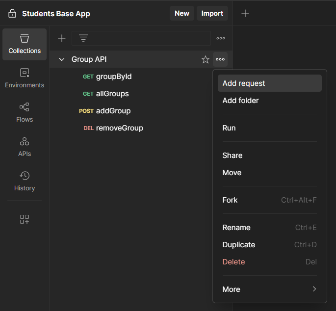
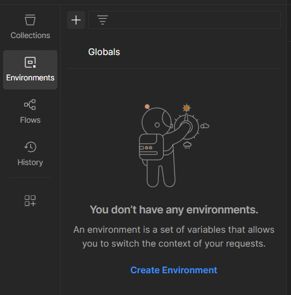

**Небольшая теория по возможностям Postman**

[Ссылка на desktop-версию](https://www.postman.com/downloads/) (или можно использовать веб-версию)

*Postman* - это инструмент, используемый разработчиками для тестирования, верификация и документирования веб-*API*. Он позволяет отправлять *HTTP*-запросы к серверу, просматривать ответы, а также автоматизировать тестирование *API*.

### Начало работы

Первым делом необходимо создать *Workspace* - это среда, в которой вы работаете с запросами, коллекциями и окружениями. Она создается для каждого проекта или задачи.

<p align="center">
  
</p>

Далее необходимо создать коллекцию (*Collection*) - это группа запросов, объединённых логически (например, все эндпоинты одного *API*).

<p align="center">
  
</p>

И теперь можно создавать запросы.

<p align="center">
  
</p>

В окне создания запроса можно указать *HTTP*-метод, *URL*, параметры запроса, тело запроса, заголовки и скрипты, выполняемые до и после запроса.

Для того, чтобы в каждом запросе не вводить адрес хоста (а тем более при тестировании и продакшене *API* может быть развернуто на разных хостах), можно создать переменные.

Для определения переменных нужно создать среду (*Environment*).

<p align="center">
  
</p>

И теперь можно определять переменные.

<p align="center">
  
</p>

Можно создать несколько сред для различных ситуаций. Например, создаем среды для тестирования и продакшена. В них опередяем переменную `base_url` со значением:
- для теста: `http://localhost:8080/api/v1`
- для продакшена: `https://fast-cloud/api/v1`

И теперь можно использовать переменную в *URL* запросов и быстро изменять ее значение путем переключения сред.

<p align="center">
  
</p>

### Написание автоматизированных тестов

Скрипты для тестирования пишутся во вкладке `Tests` каждого запроса. *Postman* использует встроенный движок *JavaScript*.

Ниже представлен самый простой тест - проверка *HTTP*-кода ответа.

```javascript
pm.test("Описание теста", function () {
    pm.response.to.have.status(200);
});
```

- `pm` - объект *Postman API*
- `pm.test` - функция определения теста
- `pm.response` - объект ответа
- `to.have.status(200)` - ожидаемый *HTTP*-код ответа

В редакторе скриптов есть базовый *IntelliSense*, который может давать подсказки по *Postman API*.

Ниже представлен пример проверки содержимого *JSON* объекта из ответа.

```JavaScript
// проверяем, что контент ответа является JSON объектом
// путем проверки заголовка Content-Type
pm.test("Content-Type = application/json", function () {
	// проверяем есть ли вообще такой заголовок
    pm.response.to.have.header("Content-Type");
    // и проверяем его значение
    pm.expect(pm.response.headers.get("Content-Type")).to.include("application/json");
});

pm.test("JSON содержит ключ 'id'", function () {
	// преобразуем тело ответа в JSON-объект
    let jsonData = pm.response.json();
    // проверяем наличие ключа id в объекте
    pm.expect(jsonData).to.have.property("id");
});

pm.test("Поле 'success' = true", function () {
    let jsonData = pm.response.json();
    pm.expect(jsonData.success).to.eql(true);
});
```

Если необходимо, можно сохранять данные ответа в переменные среды (например, при авторизации: сервер возвращает токен, который необходимо включать в запросы, требующие авторизацию).

```javascript
let jsonData = pm.response.json();
pm.environment.set("token", jsonData.token);
```

Можно так же проверять время ответа:

```javascript
pm.test("Время ответа < 500мс", function () {
    pm.expect(pm.response.responseTime).to.be.below(500);
});
```

Для генерации шаблонов тестов можно использовать помощника *Postbot*. Включить его можно внизу справа:

<p align="center">
  
</p>

[Подробнее про тестирование в *Postman*](https://learning.postman.com/docs/tests-and-scripts/write-scripts/test-scripts/)

Тесты можно запустить вручную (выполняются при отправке запроса кнопкой `Send`), можно и в автоматизированном режиме. Для этого необходимо открыть `Runner` (кнопка внизу справа, возле `Postbot`).

В окне *Runner* необходимо перетащить коллекцию с запросами и настроить параметры запуска:
- для тестирования количество итераций задаем равное `1`
- во вкладке *Advanced Settings* можно убрать все галочки, кроме пункта `Turn off logs during run`
	- опционально можно указать `Stop run if an error occurus`, если необходимо прекратить тестирование после первого неудачного теста

После запуска *Runner* будут выполнены все запросы в указанных коллекциях и выведены результаты тестов.

<p align="center">
  
</p>

### Написание документации к API

*Postman* автоматически генерирует документацию к *API*. Вам необходимо только описать методы.

Для просмотра сгенерированной документации необходимо выбрать коллекцию в *API* и нажать на `View complete documentation`.

<p align="center">
  
</p>

В результате, *Postman* сгенерирует документацию по коллекции запросов. В документации можно написать описание к коллекции и описание к запросам. Для описания используется формат [*Markdown*](https://ru.wikipedia.org/wiki/Markdown). 

Также *Postman* автоматически умеет генерировать примеры использования запросов для различных языков программирования. Но для этого необходимо составить такой пример.

Для этого открываем запрос и отправляем его. В окне с полученным ответом нажимаем на кнопку `Save Response` (вверху справа).

<p align="center">
  
</p>

*Postman* создаст пример этого запроса, ответ на который можно подредактировать при необходимости. Примеров можно создать несколько (не забываем указывать их названия).

Теперь, если снова открыть документацию, появится пример кода для выполнения запроса на выбранном языке программирования (его можно выбирать вверху, параметр `Language`).

Далее необходимо упаковать все коллекции в одну коллекцию *API*. Для этого создаем коллекцию *API*.

<p align="center">
  
</p>

Заполняем информацию об *API*: название, описание. Добавляем необходимые коллекции с запросами (выбираем пункт `Copy existing collection`).

<p align="center">
  
</p>

Теперь регистрируем конечную версию документации к *API*. Для этого переходим в основное окно с *API* и нажимаем на кнопку `Publish`. И теперь, нажав на созданную версию документации (в том же месте, где и находится кнопка `Publish`), можно посмотреть полную документацию к *API*.